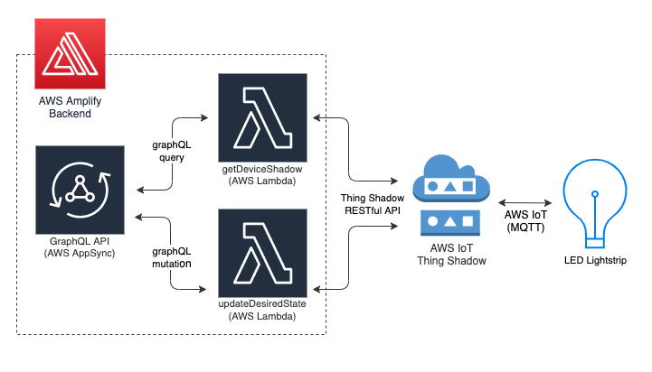

# Color Picker
This is a companion app for my LED Lightstrip. After authenticating, users are able to change the color and number of LEDs, as well as turn the strip on and off. Future plans include adding permissions around device state updates, device management (add/update/delete devices), and adding additional device types.

## Related Repositories
* [Device Firmware (ESP8266/WS2812B)](https://github.com/thomasphorton/esp8266-lights)

## Architecture/Data Flow

* React frontend with AWS Amplify requests device state from AWS AppSync API and updates UI.
* Frontend controls trigger GraphQL mutations that are mapped to Lambda custom resolvers.
* Lambda resolvers interact with AWS IoT Thing Shadow RESTful API to set desired device state.
* Device receives message, updates physical state, and then updates reported state via MQTT.

### **not implemented yet**
* IoT rules engine filters for reported state changes and triggers a Lambda function.
* Lambda function triggers a GraphQL mutation.
* Frontend subscribes to mutations of reported state and updates as needed.

## Setup
There are currently some manual steps required after deploying the amplify app:

* Add IoT permissions to Lambda execution roles for `getDeviceShadow` and `updateDesiredState`.
* Add `IOT_ENDPOINT` environment variable to `getDeviceShadow` and `udpateDesiredState` Lambdas.